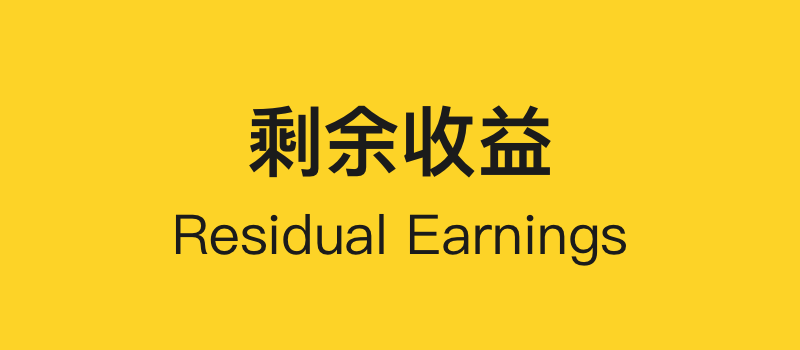
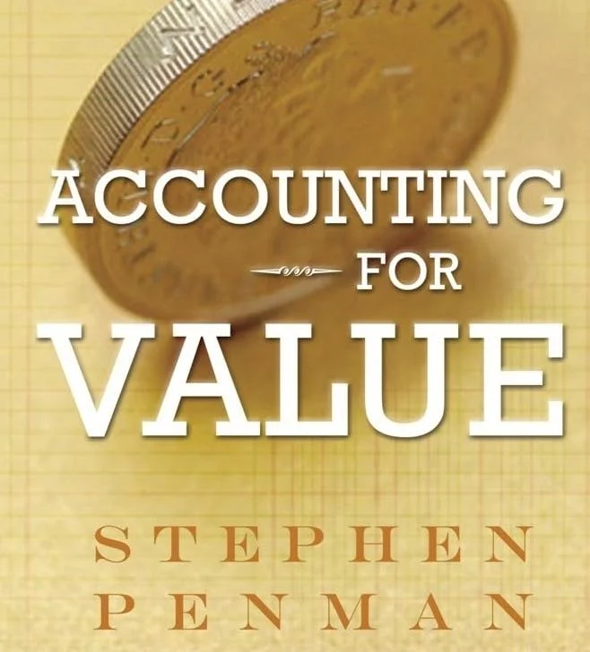
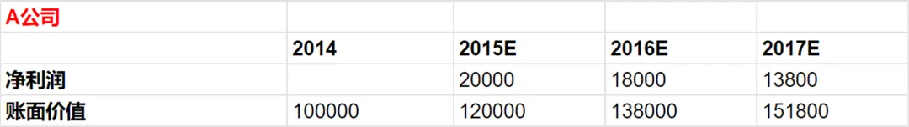
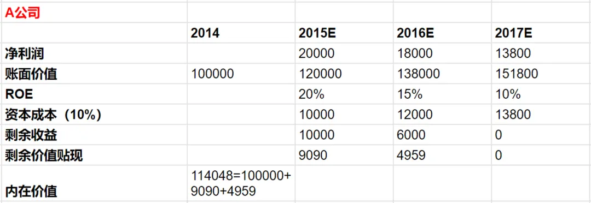
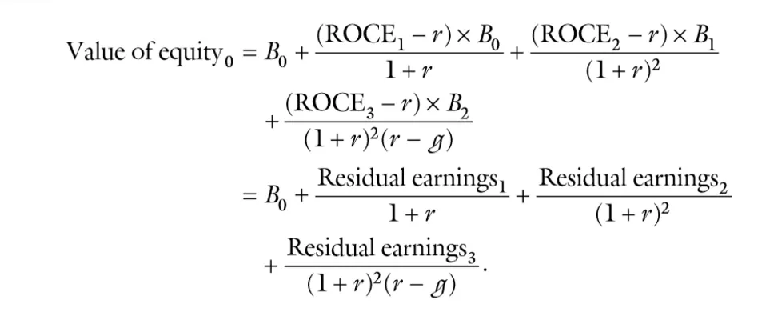
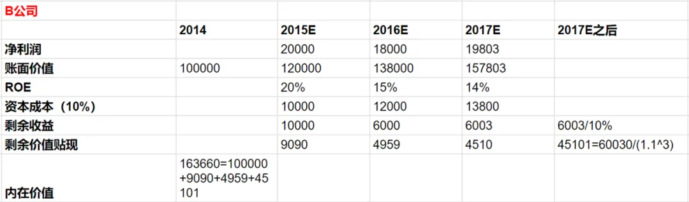
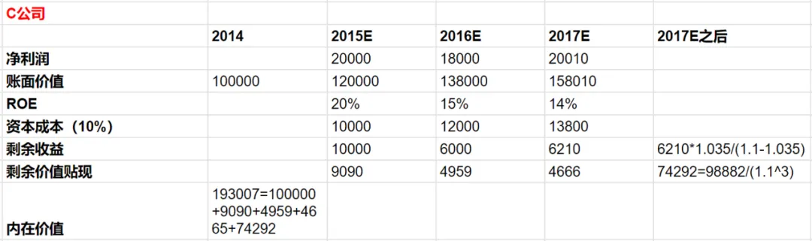
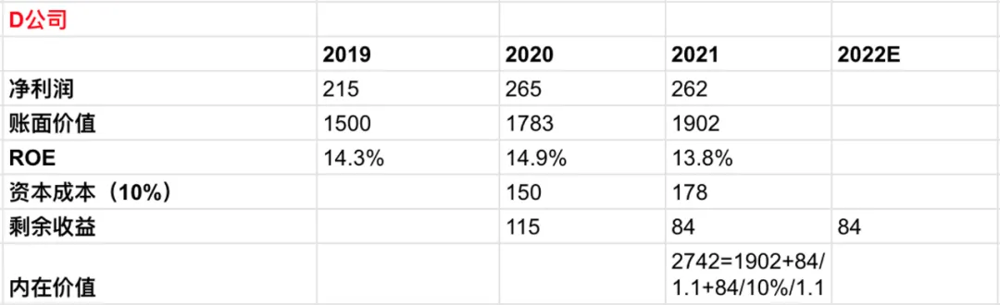

支付的是价格，得到的是价值。

## 一、账面价值和内在价值

对于内在价值的评估，巴菲特使用的是所有者收益。[如何计算所有者收益？以Scott Fetzer为例](/blog/03-how-to-calculate-owner-earnings)

Todd Combs 在 Graham & Dodd 2022 年度早餐会的分享中，也提到伯克希尔关注所有者收益，报告收益与所有者收益相近是一个好的信号。

此外，在 1994 年致股东信中，巴菲特阐述了账面价值与内在价值的关系：

> 我们来看一种投资形式——大学教育，这能让你更好地理解账面价值与内在价值的区别。上大学的成本，可以看作“账面价值”。算得更仔细点，还要加上如果不去上大学直接工作能赚的钱。在这里，我们姑且先不考虑大学教育的非经济的效益，只考虑经济价值。

> 我们必须先估算这位学生毕业后其一生能获得的收益，减去要是他没有接受大学教育能赚得的收益。将这个差值，按照一个合适的利率进行贴现，得到毕业的那天的贴现值。最终的数字就是大学教育的内在经济价值。有些毕业生可能会发现，其账面价值高于计算出来的内在价值，这就表示这个大学上得不值；要是内在价值远高于账面价值，上大学这笔投资就是明智的。不管是哪种情况，有一点很明确，账面价值不能衡量内在价值。

接下来，看另外一个与估值相关的概念：剩余收益（Residual Earnings）。出自 Stephen Penman 的 A*ccounting For Value*一书。

## 二、剩余收益

假设一家 A 公司，2014 年 12 月 31 日的账面价值（Book Value）为 100,000 元。之后，2015 到 2017 年预估的净利润和账面价值如下表：

机会成本（即 Cost of Capital 资本成本）假设是 10%。

根据以上信息，我们怎么计算 2014 年年底，A 公司的内在价值？

内在价值 = 账面价值 + 推定价值（Speculative Value）

（1）账面价值：可以从资产负债表上得到，这里是 100,000元 。

（2）推定价值：在未来的账面价值盈利情况。由于未来是不确定的， 所以，我们把这部分称作推定价值。

先计算 2015 年的推定价值。

2014 年账面价值是 100,000 元，ROE 为 10%，即我们期望的最低回报是 10,000 元。

2015 年预期的净利润是 20,000 元，对应 ROE 就是 20%。比期望的最低回报多了 10,000 元，即剩余收益。

2016年，用 120,000 元的账面价值，赚得净利润 18,000 元，对应 ROE 为 15%。资本成本为 12,000 元，计算得剩余收益 6,000 元（18,000-12,000）。

同理，得到 2017 年的各项数据。

最后，将 2015-2017 年的剩余价值贴现，加 2014 年的账面价值，得到内在价值为 114,048 元。

## 三、永续增长型剩余收益

上面的例子中，A 公司从 2017 年开始，剩余价值就为 0 了。对于一家有持续竞争力的企业，未来很长的一段时间，它还是会有正剩余收益。这样的情况，我们怎么去评估内在价值？

Penman 给了以下公式：

为了理解这个公式，我们再假设一个 B 公司，和 A 公司很类似。不同的点是，B 公司在 2017 年是正的剩余收益，且之后每年的剩余收益都是常数 6003 元。对应2017年之后的贴现值为 45,101 元（6003/10%/(1.1^3））。

接着，与文章第二部分的计算方式类似，计算得 B 公司在 2014 年的内在价值为 163,660 元。

在 B 公司基础上，再假设一个 2017 年之后剩余收益以 3.5% 增速稳定增长的 C 公司。对应 2017 年之后的贴现值为 98,882 元（6210*1.035/(1.1-1.035)）。

同上理，计算得 C 公司在 2014 年的内在价值为 193,007 元。

三家公司，虽然账面价值相同，但内在价值却不一样。类似巴菲特在 2007 年致股东信中，提到的三类生意：伟大生意（the Great）、好生意（the Good）、糟糕生意（the Gurusome）。

## 四、实例练习

找一家 A 股的上市公司，应用剩余收益进行简单练习。简化起见，暂时直接使用财务报表的数据，不对财务数据调整和公司进行深入分析。

已知 D 公司，2019-2021 年的净利润和账面价值（单位为亿元）。该公司的 ROE 相对比较稳定，维持在 14% 左右。假设，2022 年的剩余收益和 2021 年一样，为 84 亿元。之后，每年的剩余收益保持不变均为 84 亿元。

同上，我们得到剩余价值零增长的情况下，内在价值为 2742 亿元。

比较 2021 年底的市值 5407 亿元，可以看到市场价格反映了投资者对公司增长的预期。我们可以反推出，为了达到当前的市值所需的业绩增速。

