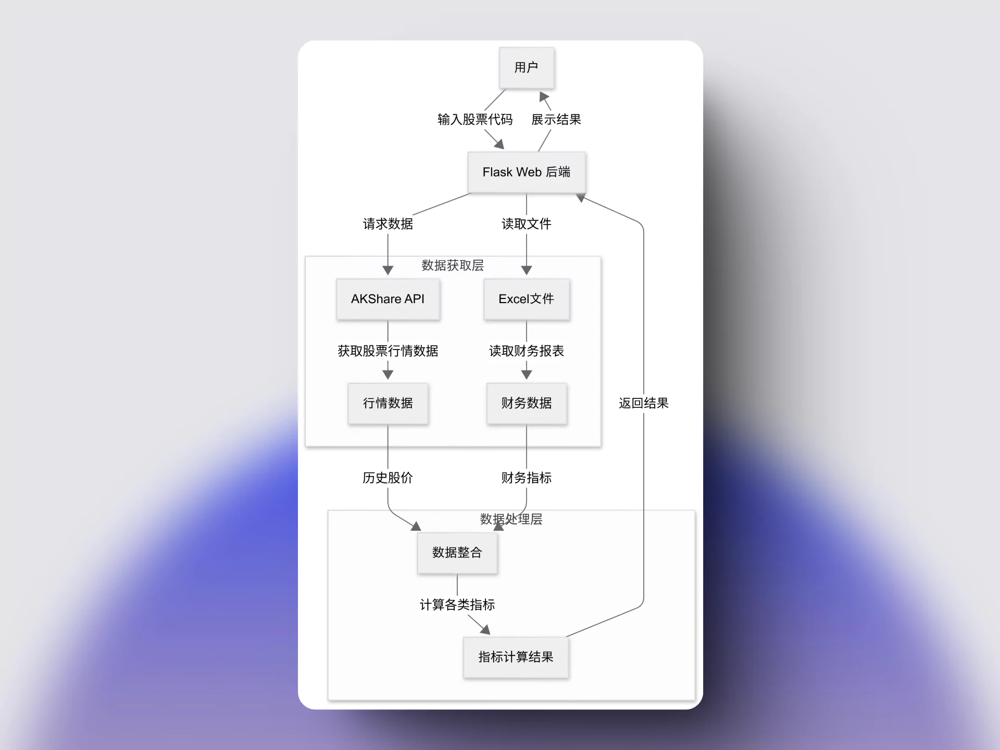

AI 很好玩，AI 让创造变得更简单。

2024 年下半年，我成功转岗到公司的 AI 智能应用组开始相关产品设计工作。
在工作之余，我尝试用 Cursor 开发了几个自用小应用。

## 1. Ashare Value Line

个股基本面分析工具，类似国外的 Value Line 或者 [roic.ai](https://www.roic.ai/)。

效果：财务数据整理耗时从 3 小时左右，降低到 1 分钟。

## 2. 周报生成器 
[在线地址](https://bestlists.top/weekly_memo/)

## 3. 批处理工具

