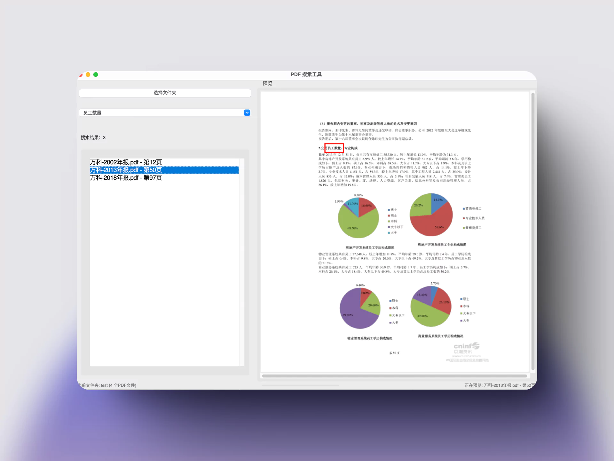
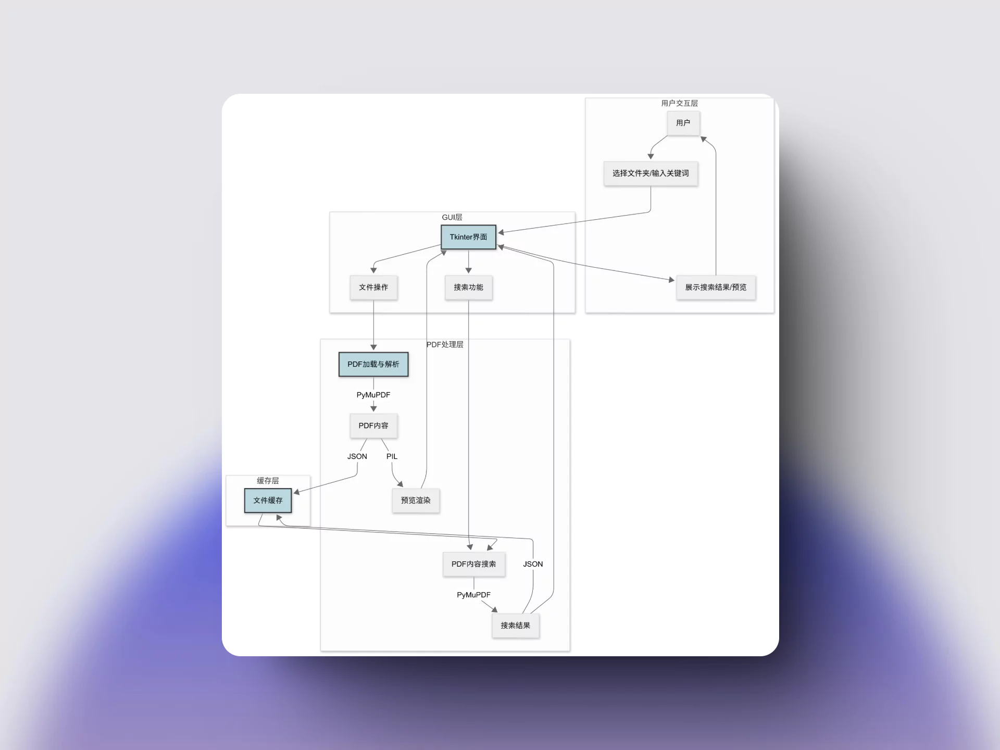
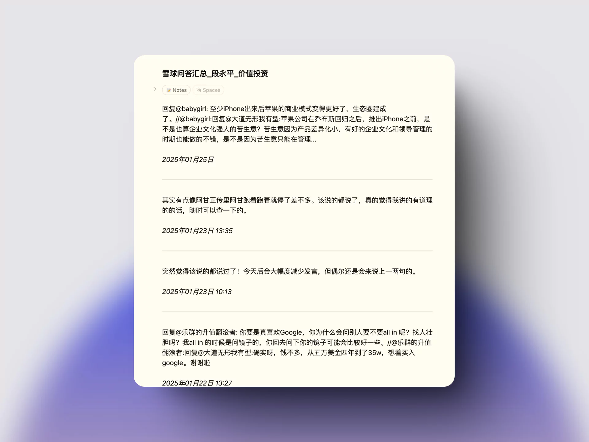
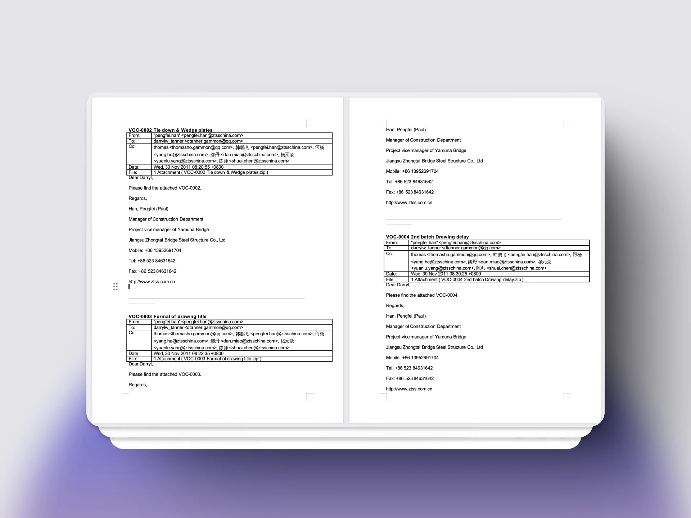

AI 很好玩，AI 让创造变得更简单。

2024 年下半年，我成功转岗到公司的 AI 智能应用组开始相关产品设计工作。
在工作之余，我尝试用 Cursor 开发了几个自用小应用。

## 1. Ashare Value Line

个股基本面分析工具，类似国外的 Value Line 或者 [roic.ai](https://www.roic.ai/)。

效果：财务数据整理耗时从 3 小时左右，降低到 1 分钟。

程序整体交互流程如下：

## 2. 周报生成器 
[在线地址](https://bestlists.top/weekly_memo/)

使用流程：填写完周报内容后，点击“复制 HTML”并将其粘贴到邮件中，以 HTML 格式发送。 

效果：此工具能够提升邮件的可读性和美观性，避免了使用纯文本、表格或截图时可能出现的可读性差的问题。

## 3. 多 PDF 全文检索器

检索关键词在多个 PDF 文件中的位置，并高亮显示。

## 4. 批处理工具
- GreatInvestorQuoteCards：批量生成精美投资大师语录卡片
  

- DuanXueqiuDownloader：采用 Selenium 框架批量抓取段永平雪球网的所有问答

- email2Word：将多个邮件内容整合在一个 Word 文档

