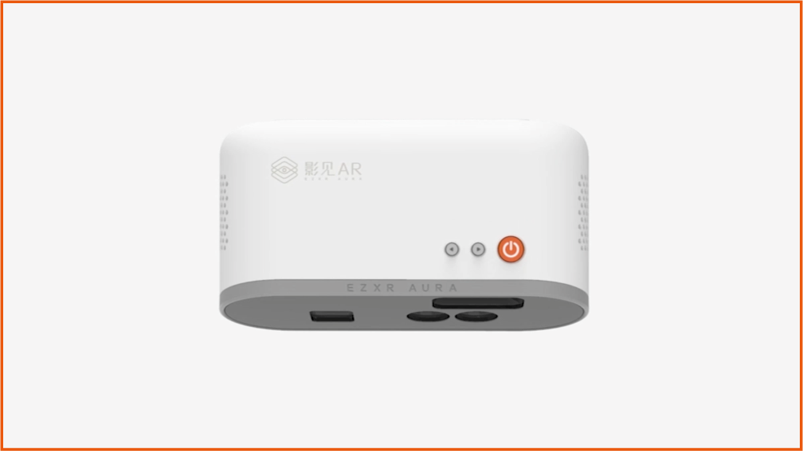
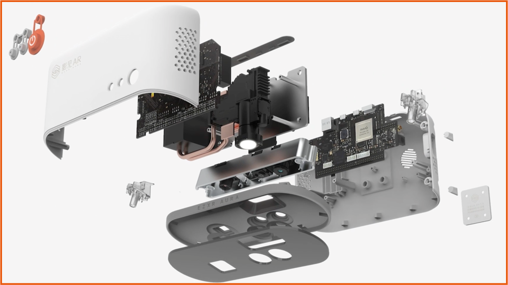

[影见官方网站](https://ar.163.com/yingjian)  

## 工作
- 商业层：负责数字展览场景 Go To Market，完成从 0 到 1 商业案例落地；参与智慧教育场景商务拓展。
- 设计层：独⽴负责在线商店系统，幼儿教育互动应用研发，参与系统级 Metaphor 和 User Interface 设计。

## 成果
- [获 2019 年中国设计智造 DIA（佳作奖）](https://www.di-award.org/collections/detail/483.html?page_size%3D1000%26page%3D1%26year%3D2019%26award_type%3D4%26award_group%3D1%26category_id%3D299)
- [落地杭州萧山戴村镇“城市规划 AR 智慧数字沙盘”](https://ar.163.com/news/detail?id=149&type=-1)
- [亮相央视 CCTV-10《时尚科技秀》](https://ar.163.com/news/detail?id=111&type=-1)
 
