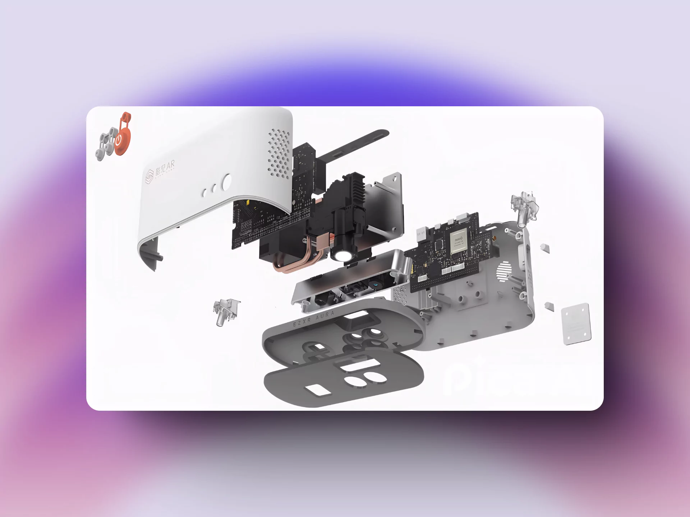
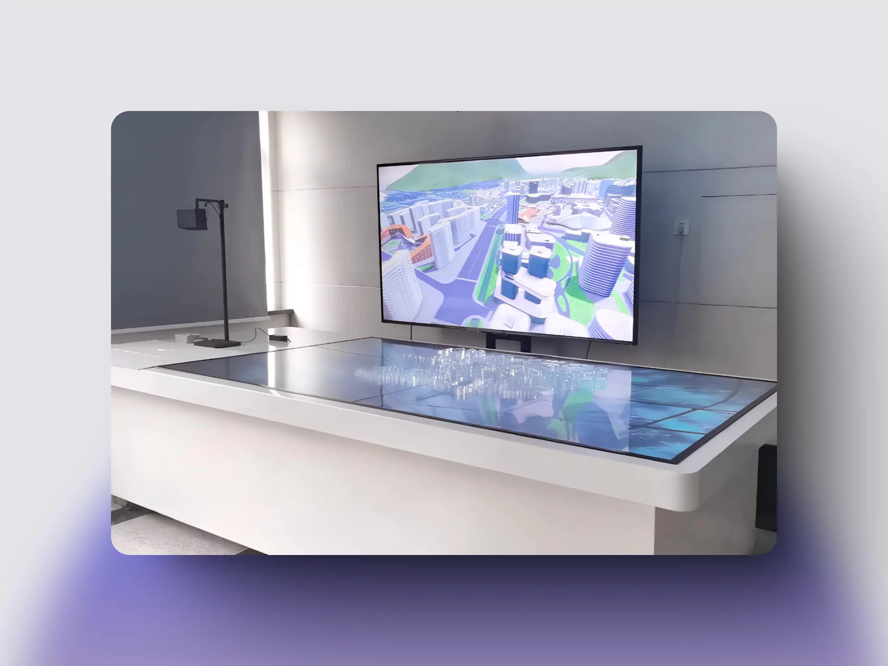

[影见官网](https://ar.163.com/yingjian)  

## 工作
- 商业方面：负责数字展览场景 Go To Market，搭建最小 MVP，完成从 0 到 1 商业案例落地， 交付 4 项智慧展厅项目（杭州萧山区图灵小镇、戴村镇数字展厅、国家电网蜀山站、台州市青少年宫）；参与智慧教育场景应用开发与商务拓展；

- 设计方面：独⽴负责在线商店系统，幼儿教育互动应用研发；参与系统级 User Interface 设计，建模设计与交互规范定义，撰写和维护 [Aura SDK 文档](https://ezxr.github.io/AuraSDK_Doc/index.html)。

<iframe width="100%" height="500" src="https://ar-scene-source.nosdn.127.net/cfe361a4333ef7d671509fa7db0b6a58.mp4" scrolling="no" border="0" frameborder="no" framespacing="0" allowfullscreen="true"></iframe>

## 成果
- [获 2019 年中国设计智造 DIA（佳作奖）](https://www.di-award.org/collections/detail/483.html?page_size%3D1000%26page%3D1%26year%3D2019%26award_type%3D4%26award_group%3D1%26category_id%3D299)
- [落地杭州萧山区戴村镇“城市规划 AR 智慧数字沙盘”](https://ar.163.com/news/detail?id=149&type=-1)
- [杭州萧山区图灵小镇互动展厅](https://www.ezxr.com/news/detail?id=190&type=-1)
- [亮相央视 CCTV-10《时尚科技秀》](https://ar.163.com/news/detail?id=111&type=-1)
- 爆款幼儿互动应用“海底大世界”累计获超 5 万人次体验
 
