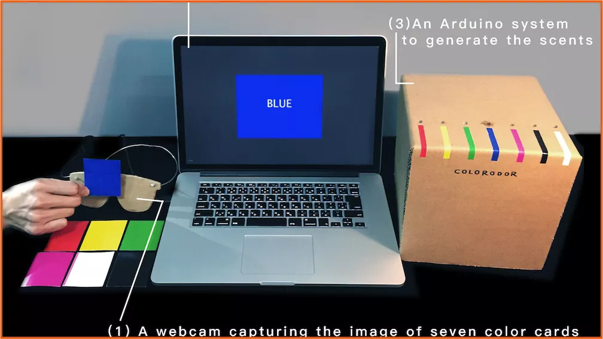

[CHI 2017 Late-Breaking Work 录用](https://dl.acm.org/doi/10.1145/3027063.3053186)

## 项目贡献与收获
- 方案研究 + 交互装置原型软硬件制作 + 用户测试 + 视频剪辑；
- 论文 Prototype Design 部分撰写；
- 前往美国参加会议 Presentation 并与 MIT Media Lab 教授交流学习。
