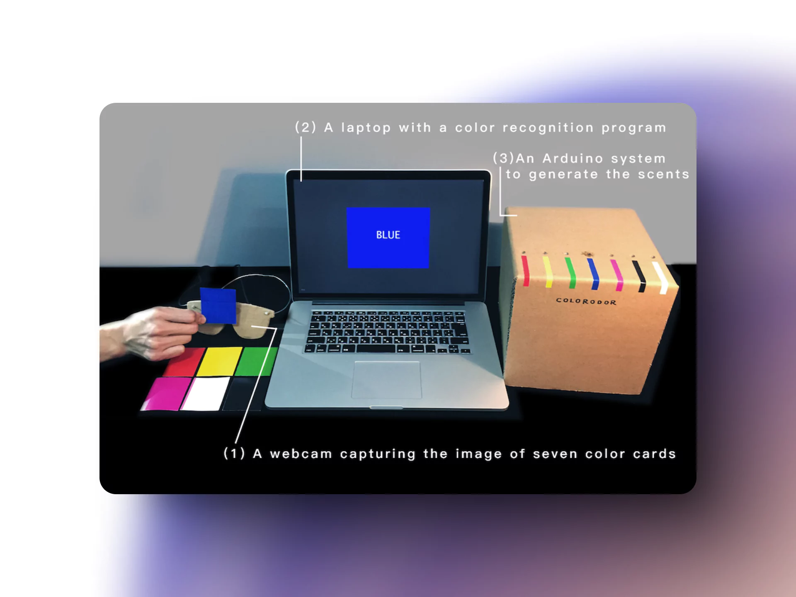

[CHI 2017 Late-Breaking Work 录用](https://dl.acm.org/doi/10.1145/3027063.3053186)

<iframe width="100%" height="500" src="//player.bilibili.com/player.html?isOutside=true&aid=113971738709843&bvid=BV12vN1e5E8E&cid=28291105739&p=1" scrolling="no" border="0" frameborder="no" framespacing="0" allowfullscreen="true"></iframe>

## 项目贡献与收获
- 方案研究 + 交互装置原型软硬件制作 + 用户测试 + 视频剪辑；
- 论文 Prototype Design 部分撰写；
- 前往美国参加会议 Presentation 并与 MIT Media Lab 教授交流学习。
