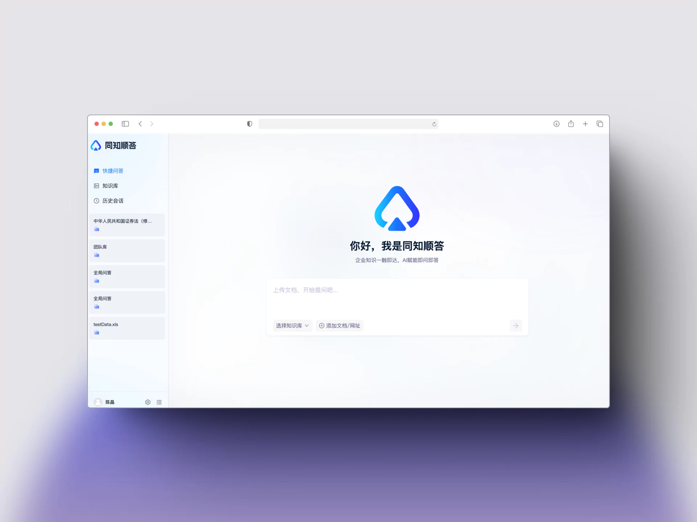
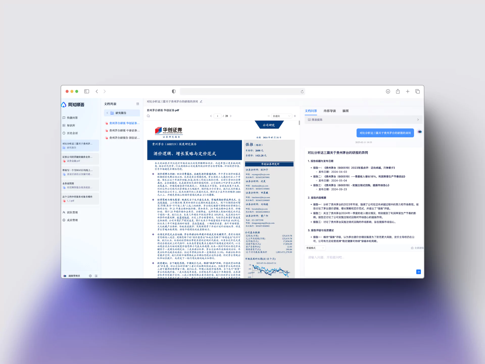
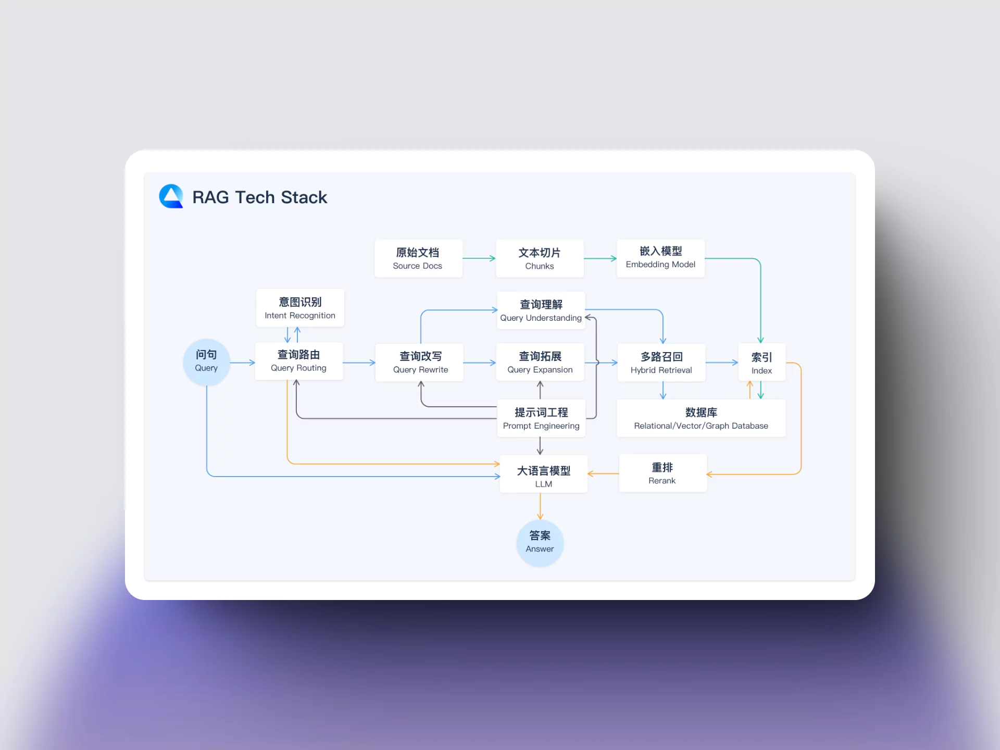
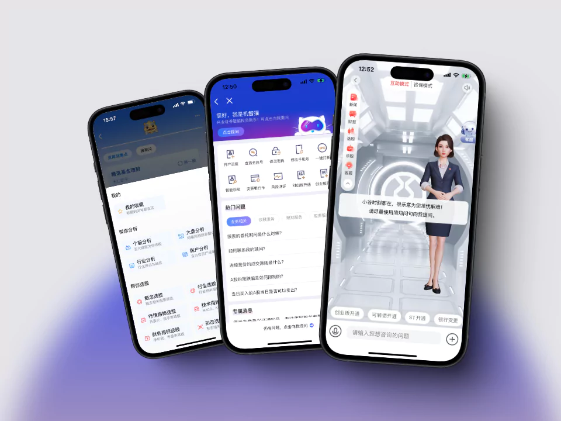
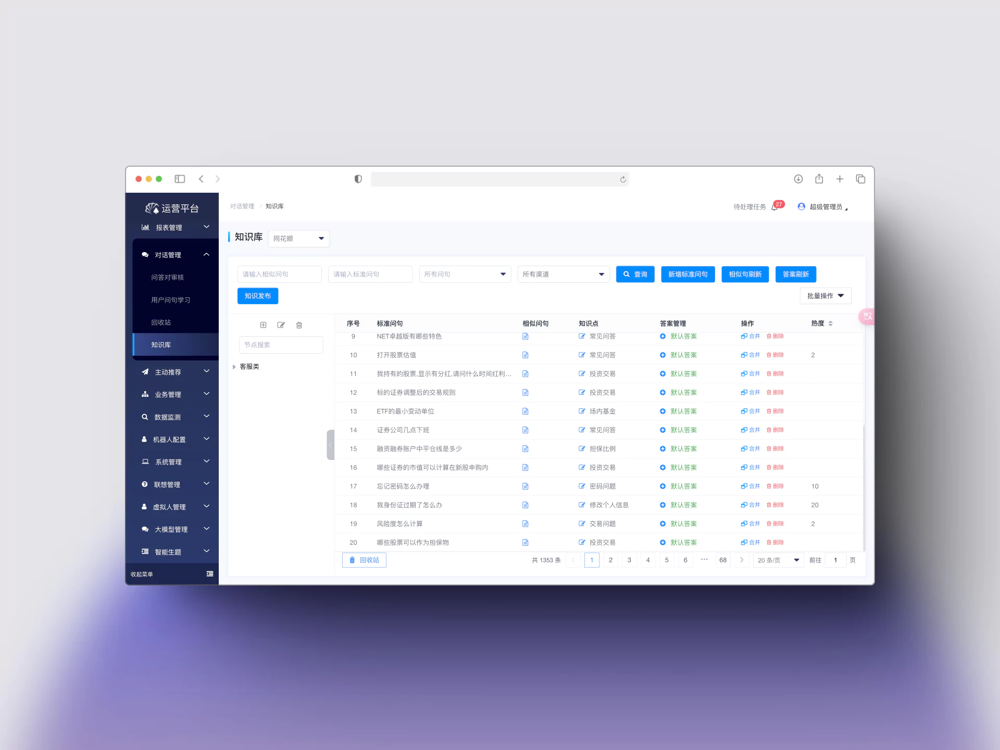

[同花顺智能科技官网](http://www.thsyun.com/#/homepage)  

**同知顺答**：基于 RAG 的企业知识库智能问答产品

RAG Tech Stack

---

**智能投资助理**：基于同花顺问财金融能力的智能投资助理

运营管理后台

  

## 工作 
- 独立负责 RAG 知识库产品同知顺答的产研和商业客户落地；
- 负责智能投资助理重点券商客户需求承接和基于问财大模型版本金融能力商业化落地。

## 成果
- 同知顺答成单商业客户 3 家：上海证券、南华期货、银河期货。
- 智能投资助理：兴业证券、浙商证券、华福证券、国泰君安证券等 5+重点客户需求承接交付。

