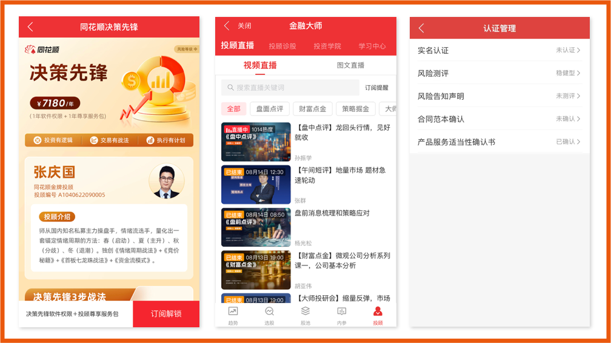

[官网](https://www.ths123.com/soft.html)  

## 工作 
负责金融大师、决策先锋等付费产品的投顾服务和合规功能。

## 成果
- 决策先锋投顾版产品，上线后首月营收超 1000 万元。
- 金融大师投顾直播功能，日均活跃用户数超 3 千；上线 AI 审核功能，日均直播互动内容审核时间从 3 小时降至 10 分钟。
- 上线风险告知声明合规流程，已服务用户超 2 万，单用户合规审核时间节省超 10 分钟。 
- 搭建云软件内容管理后台系统，承接 10+ 业务方内容数据和 3 项合规统计数据。

