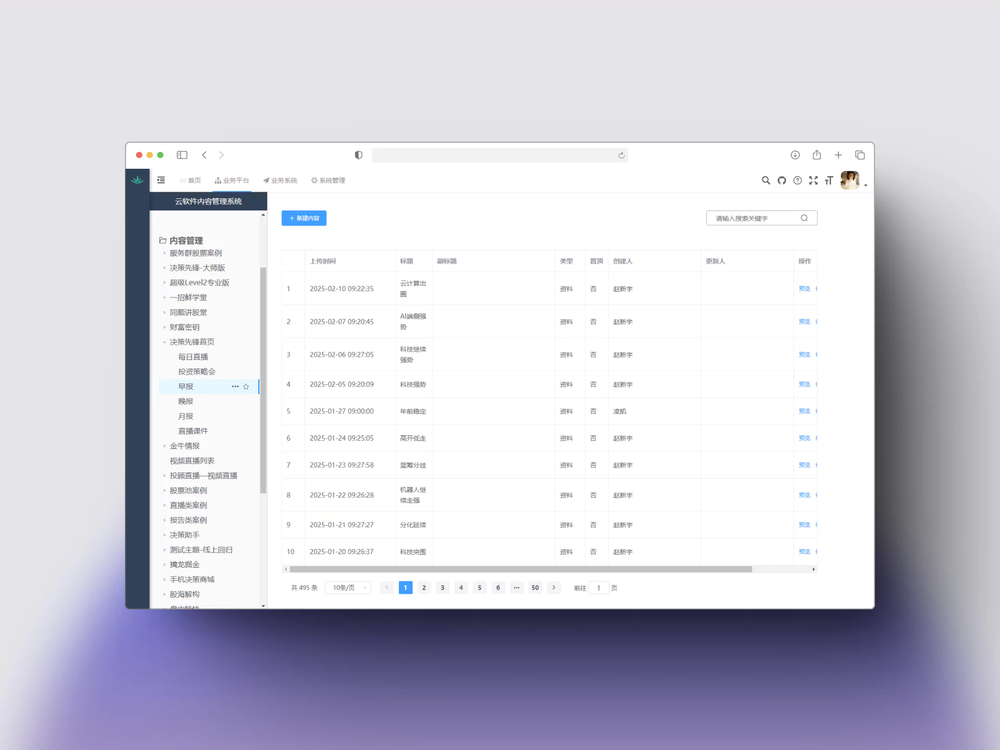
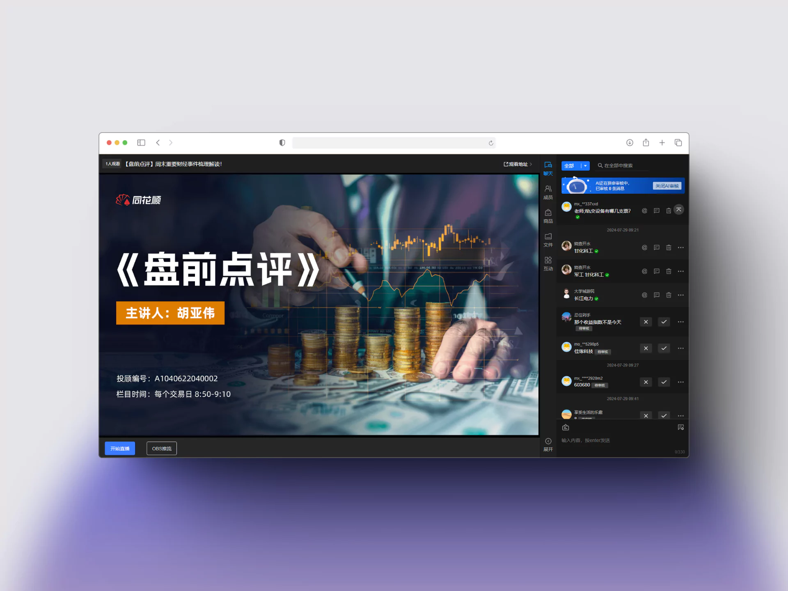

[官网](https://www.ths123.com/soft.html) 

金融大师、决策先锋等付费产品的投顾服务和合规功能：

云软件内容管理后台：

投顾直播服务（集成 AI 审核）：

## 工作 
- 独立负责金融大师、决策先锋等付费产品的投顾服务和合规功能；
- 独立负责云软件收费产品内容管理后台。

## 成果
- 决策先锋投顾版产品，上线后首月营收超 1000 万元，年度业绩收入超 1 亿元；
- 金融大师投顾直播功能，日均活跃用户数超 3 千，集成 AI 审核功能，日均直播互动内容审核时间从 3 小时降至 10 分钟；
- 上线风险告知声明合规流程，已服务用户超 2 万，单用户合规审核时间节省超 10 分钟； 
- 搭建云软件内容管理后台系统，承接 10+ 业务方内容数据和合规类数据统计。

